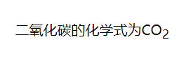
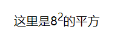
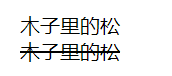
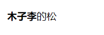
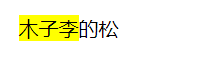

# 基本标签

## 基本标签

### div
`div`无具体实义，为通用块级标签
```html
<div>木子李的松</div>
```

### p
`p`为段落标签，块级标签
```html
<p>木子李的松</p>
```

### span
`p`标签无实义，行内级标签
```html
<span>木子李的松</span>
```
## 文本描述

### sub
`sub`标签用于数字的下标内容
```html
二氧化碳的化学式为CO<sub>2</sub>
```


### sup
`sub`标签用于数字的上标内容
```html
这里是8<sup>2</sup>的平方
```


### del
`del`标签表示删除的内容
```html
木子里的松<br/>
<del>木子里的松</del>
```


### progress
`progress`标签表示完成任务的进度
```html
<progress value="70" max="100">完成70%</progress>
```


## 文本强调

### strong
`strong`标签用于文本的加粗
```html
<strong>木子李</strong>的松
```


### mark
`mark`标签用于文本的突出显示
```html
<mark>木子李</mark>的松
```


