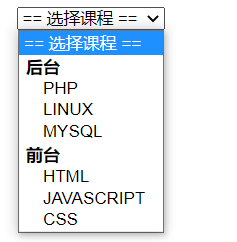
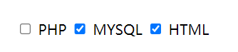

# 表单与列表

## 表单

### form

数据的提交通过`form`表单来处理

```html
<form action="后台地址" method="POST">
  <input type="text" />
  <input type="submit" />
</form>
```

| 属性   | 说明                 |
| ------ | -------------------- |
| action | 后台地址             |
| method | 提交方式 GET 或 POST |

### input

`input`用于输入单行文本使用

```html
<input
  type="text"
  name="title"
  required
  placeholder="请输入标题"
  maxlength="5"
  value=""
  size="100"
/>
```

| 属性        | 说明                                                                                   |
| ----------- | -------------------------------------------------------------------------------------- |
| type        | 表单类型默认为 text                                                                    |
| name        | 后台接收字段名                                                                         |
| required    | 必须输入                                                                               |
| placeholder | 提示文本内容                                                                           |
| value       | 默认值                                                                                 |
| maxlength   | 允许最大输入字符数                                                                     |
| size        | 表单显示长度，一般用不使用而用 css 控制                                                |
| disabled    | 禁止使用，不可以提交到后台                                                             |
| readonly    | 只读，可提交到后台                                                                     |
| capture     | 使用麦克风、视频或摄像头哪种方式获取手机上传文件，支持的值有 microphone, video, camera |

通过设置表单的`type`字段可以指定不同的输入内容:
|类型 |说明|
| ---- | ---- |
|email |输入内容为邮箱|
|url |输入内容为 URL 地址|
|password |输入内容为密码项|
|tel |电话号，移动端会调出数字键盘|
|search |搜索框|
|hidden |隐藏表单|
|submit |提交表单|

### textarea

`textarea`文本域可以输入多行文本

```html
<textarea name="content" cols="30" rows="3">木子李的松</textarea>
```

### select

`select`下拉列表项可用于多个值中的选择

```html
<select name="lesson">
  <option value="">== 选择课程 ==</option>
  <optgroup label="后台">
    <option value="php">PHP</option>
    <option value="linux">LINUX</option>
    <option value="mysql">MYSQL</option>
  </optgroup>
  <optgroup label="前台">
    <option value="php">HTML</option>
    <option value="linux">JAVASCRIPT</option>
    <option value="mysql">CSS</option>
  </optgroup>
</select>
```



**相关属性**
| 选项 | 说明 |
| -------- | ---------- |
| multiple | 支持多选 |
| size | 列表框高度 |
| optgroup | 选项组 |
| selected | 选中状态 |
| option | 选项值 |

### radio

`radio`用于值的二选一

```html
<input type="radio" name="sex" value="boy" id="boy" />
<label for="boy">男</label>

<!-- checked：值的选中状态 -->
<input type="radio" name="sex" value="girl" id="girl" checked />
<label for="girl">女</label>
```


### checkbox

`checkbox`为复选框，用于多个值的选择

```html
<input type="checkbox" name="php" value="php" id="php" />
<label for="php">PHP</label>

<input type="checkbox" name="mySQL" value="mySQL" id="mySQL" checked />
<label for="mySQL">MYSQL</label>

<input type="checkbox" name="html" value="html" id="html" checked />
<label for="html">HTML</label>
```



## 列表

### 有序列表

```html
<ol>
  <li>1111</li>
  <li>2222</li>
  <li>3333</li>
</ol>
```

### 无序列表

```html
<ul>
  <li>1111</li>
  <li>2222</li>
  <li>3333</li>
</ul>
```

### 描述列表

```html
<dl>
  <dt>框架</dt>
  <dd>vue</dd>
  <dd>react</dd>

  <dt>网站导航</dt>
  <dd>百度</dd>
  <dd>谷歌</dd>
</dl>
```
