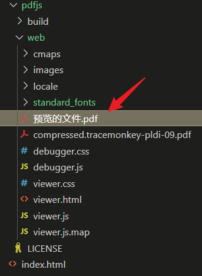
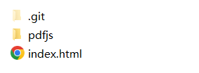
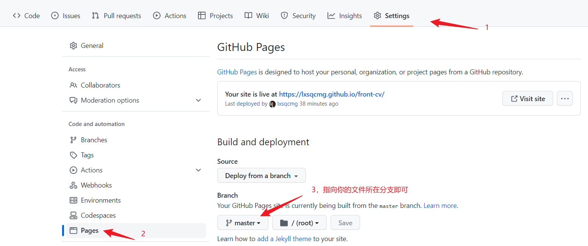

# pdfjs

PDF.js是一款基于HTML5建立的PDF阅读器，兼容移动端与PC端大部分主流的浏览器。

## 1. 下载插件

下载地址：[http://mozilla.github.io/pdf.js/getting_started/#download](http://mozilla.github.io/pdf.js/getting_started/#download)

## 2. 放置文件

将需要预览的`xxxxxx.pdf`文件放到`pdfjs`的`web`目录下 <br/>



## 3. 建立`index.html`文件

`index.html`文件需与`pdfjs目录`同级 <br/>


```html
<!DOCTYPE html>
<html lang="en">

<head>
    <meta charset="UTF-8">
    <meta http-equiv="X-UA-Compatible" content="IE=edge">
    <meta name="viewport" content="width=device-width, initial-scale=1.0">
    <title>pdfjs</title>
</head>

<body>
    <script>
        /**
         * 该文件放到pdfjs/web/下
         * 该url地址也可以是一个线上pdf文件
         */
        let url = 'xxxxxx.pdf'; 
        window.open("pdfjs/web/viewer.html?file=" + url);
    </script>
</body>

</html>
```

## 4. 文件预览

### 本地服务预览

`vscode`装个插件：`Open with Live Serve`，成功后鼠标右键通过该本地服务打开即可

### github静态站搭建预览

1）先在`github`上新建个项目，然后把本地代码上传 <br/>
2）然后在`github`上进行配置，关联分支即可<br/>



