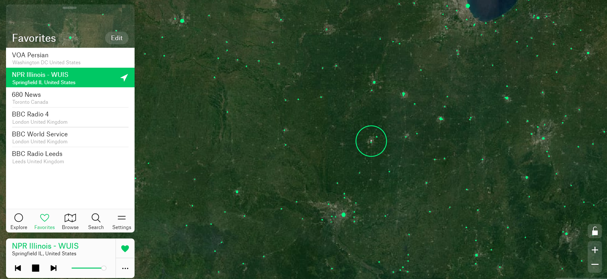

# 学习资源

## 网站

### 广播花园

::: tip
访问前提：需要[科学上网](https://tly89.com/zh/)，否则国内网络无法访问。
:::
**网址：**[广播花园`http://radio.garden/`](http://radio.garden/)  
**体验：** 无需登录，自动记录 cookie，电台种类丰富

**电台推荐**

- VOA Persian
- NPR IIIinois - WUIS
- 680 News
- BBC World 4
- BBC World Service
- BBC Radio Leeds

### 在线英语听力室

::: tip
无需科学上网，可直接访问
:::
**网址:** [在线英语听力室`http://down.tingroom.com/`](http://down.tingroom.com/)  
**体验:** 语种丰富，资源可供下载。缺点就是广告多:joy::joy:

## 应用

浏览器或者应用商店直接搜就有

### 广播花园

手机浏览器或者应用商店直接搜`radio.garden`，会有相关的应用出现，跟网页版的一样。

### 可可英语

**体验：**

- 啥都好
- 单词词汇书多
- 可听广播电台
- 有许多优秀的节目

### 傻瓜英语

专门学单词的一个应用，注重基础音标的拼读，是记单词的科学方法。
